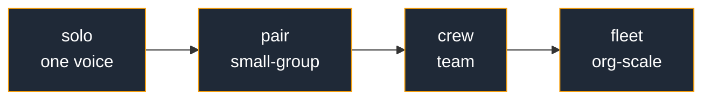
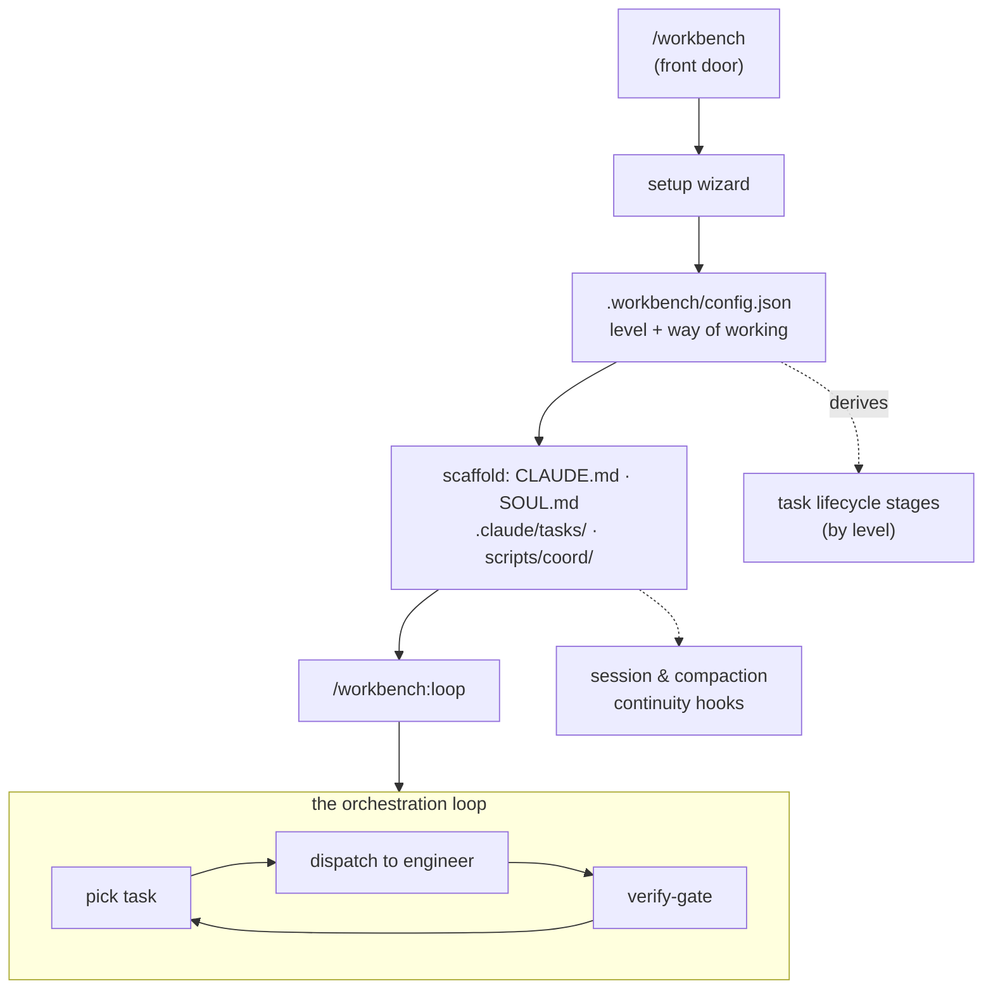

<div align="center">

<h1>workbench</h1>

<p><strong>An operating system for AI-orchestrated product building — a way of working that grows with your project, for <a href="https://claude.com/claude-code">Claude Code</a>.</strong></p>

<p>Pick a level. Get a coherent way of working. Graduate when the friction is real.</p>

<p>
  <a href="https://github.com/guuslangelaar0/workbench/releases/latest"></a> &nbsp;
  <a href="LICENSE"></a> &nbsp;
  <a href="https://github.com/guuslangelaar0/workbench/actions/workflows/ci.yml"></a> &nbsp;
  
</p>

<p>
  <a href="docs/getting-started.md">Getting started</a> &nbsp;·&nbsp;
  <a href="docs/levels.md">The levels</a> &nbsp;·&nbsp;
  <a href="docs/concepts.md">Concepts</a> &nbsp;·&nbsp;
  <a href="docs/commands.md">Commands</a> &nbsp;·&nbsp;
  <a href="https://github.com/guuslangelaar0/workbench/issues">Report an issue</a>
</p>

<p><sub>A Claude Code plugin. It writes plain markdown, shell, and JSON into your repo — uninstall it and your way of working stays on disk.</sub></p>

</div>

---

Coding agents are brilliant in the moment and amnesiac across sessions. workbench scaffolds and maintains a complete *way of working* in your repo — a maturity ladder that grows with the project, a file-based task lifecycle, session & compaction continuity, multi-session coordination, the brainstorm → spec → plan discipline, and a long-running orchestration loop — then keeps it all coherent across new sessions and context compaction. It is not a framework you import or a service you sign up for: it writes plain markdown, shell, and JSON, and teaches your Claude sessions how to use them.

## Install

workbench is a Claude Code plugin. From any Claude Code session:

```text
/plugin marketplace add guuslangelaar0/workbench
/plugin install workbench@workbench
```

Then start (or restart) Claude Code in your project. There is one command to remember — the front door:

```text
/workbench
```

On an unconfigured project it runs a short guided setup; on a configured one it shows status and the next actions.

→ Step-by-step, including a local-install smoke test: **[docs/getting-started.md](docs/getting-started.md)**.

## Quickstart

```text
/workbench                      # front door — guided setup on a new project, status on a configured one
/workbench:task "ship login"    # create your first task (auto-allocated ID, canonical format)
/workbench:mc                   # Mission Control: a dashboard of tasks, the in-review cap, build, prod
/workbench:loop                 # run the autonomous teamlead loop: pick → dispatch → verify-gate → repeat
```

That's the whole rhythm: pick a level, capture work as tasks, let the loop drive them to *verified* with evidence, and graduate the level when the project outgrows it.

## Commands

`/workbench` is the only one you have to remember; it routes to the rest.

| Command | What it does |
|---------|--------------|
| `/workbench` | Front door: set up if needed, else show status + next actions |
| `/workbench:setup` | Configure this project's way of working (guided per-axis wizard) and scaffold it |
| `/workbench:init` | Scaffold non-interactively (the wizard's config is preserved) |
| `/workbench:level` | Show the level + dials, or move `up` / `down` / to a named level |
| `/workbench:loop` | Run the autonomous teamlead loop (pick → dispatch → verify-gate → never stop) |
| `/workbench:task "<title>"` | Create a task (allocates the next ID, renders the canonical format) |
| `/workbench:epic "<title>"` | Create or list epics — groups of related tasks with a live task rollup (pair level and up) |
| `/workbench:dispatch <id>` | Move a task to in-development and dispatch it to an engineer |
| `/workbench:verify <id>` | Run a task's verification and gate it to `verified/` (or back) |
| `/workbench:mc` | Mission Control: a text dashboard of tasks, cap, build, and prod |
| `/workbench:teamlead <topic>` | Scope this session to one track and lock tasks so leads don't collide |
| `/workbench:inception` | Scope-controlled product genesis: an idea → a v1 spec + seeded backlog |
| `/workbench:architecture` | View or reconcile the C4 context backbone (authored intent ↔ graphify-extracted reality, drift) |
| `/workbench:boot` | Boot protocol: verify reality from disk, reconcile, then brief |
| `/workbench:checkpoint` | Write a `SESSION_STATE` checkpoint now for the next session |
| `/workbench:upgrade` | Reconcile this project's workbench files to the current plugin version (preserves your edits) |
| `/workbench:doctor` | Health-check: drift, stale state, in-review cap |
| `/workbench:remote` | Operate the project from your phone over Telegram, with a catastrophic-command guard |

→ Full reference: **[docs/commands.md](docs/commands.md)**.

## The maturity ladder

The level describes your **coordination surface** — how many independent streams you must keep coherent — not a ranking of quality. You pick a level; workbench derives a coherent set of *dials* from it.



| Level | Coordination surface | When it fits | Loop autonomy |
|-------|---------------------|--------------|---------------|
| **`solo`** | One person, one voice | A single builder, main-only, personal projects | most autonomous — `auto-continue` |
| **`pair`** | Small-group alignment | 2–3 contributors, feature branches, light review | `auto-continue` |
| **`crew`** | Team coordination | 3–8 people, tagged releases, epics, a staging gate | `suggest-wait` |
| **`fleet`** | Org-scale governance | 8+ contributors, release trains, federated repos | most gated — `suggest-review` |

Each level is a **preset over seven dials** — team topology, release model, work decomposition, architecture formality, user-facing surfaces, knowledge-graph scope, and loop autonomy. You change one thing (the level) and all seven move together coherently; no drift, no incoherent combinations like "release trains, but solo."

Graduation is **recommend-only**: `/workbench:level up` shows exactly what changes and asks before applying. Move up when the current level's friction is real — not when the project is theoretically "ready."

→ Full breakdown of each level and **the struggle it solves** in **[docs/levels.md](docs/levels.md)**.

## The context backbone

Workbench keeps a [C4](https://c4model.com)-style architecture model in `.claude/architecture/` that scales with the level (`context` → `+containers` → `+components`). Its point is the gap between two things:

- **Authored intent** — what you *mean* the system to be: the hand-written C4 docs.
- **Extracted reality** — what the system *actually is*: [graphify](https://github.com/safishamsi/graphify) extracts the real module graph, god-nodes, and call edges from the code.

**Drift between them is a first-class signal, not a failure.** `/workbench:architecture drift` aligns the two for you — which extracted core abstractions are named in your docs, which declared components have no code yet — and leaves the *judging* to you, because graphify's hubs include runtime noise that doesn't belong in a C4 model. Surface real drift, reconcile it, don't fake it.

→ The model behind it: **[docs/concepts.md](docs/concepts.md)**.

## How it works



Five capabilities, all configured from the level you pick:

- **Task lifecycle** — tasks are markdown files under `.claude/tasks/`; their status *is* the subdirectory they live in (`backlog → in-development → in-review → verified → …`), and transitions are `git mv`. A bounded in-review cap forces verification to happen continuously instead of piling up. Higher levels add `staged`, `shipped`, and `release-candidate` stages.
- **The orchestration loop** — a long-running teamlead loop that picks the highest-impact unblocked task, dispatches it, and gates it. The lead coordinates; engineers implement; nothing reaches *verified* without evidence. Universal rule: **bugs auto-file as tasks; new features are *suggested*, never auto-built.**
- **Continuity** — `SessionStart` re-grounds each new session from disk, `PreCompact` checkpoints before context is compacted, and a `SESSION_STATE.md` handoff means the next session resumes from the file alone.
- **Coordination** — multiple concurrent sessions register presence, claim tasks, and get warned before they collide; worktrees isolate parallel work.
- **Discipline built in** — brainstorm → spec → plan before building; "done" means *verified with evidence*, never "should work."

→ The model behind each: **[docs/concepts.md](docs/concepts.md)**.

## Configuration

Everything lives in `.workbench/config.json`. It stores your **level**; the seven dials and the lifecycle stages are *derived from the level at read-time*, so there is nothing to keep in sync. Override a single dial via the optional `dial_overrides` object without leaving the preset.

→ The full config model: **[docs/configuration.md](docs/configuration.md)**.

## Tests

```sh
bash test/all.sh                 # fast, offline unit + integration suites (no API, no cost)
WB_E2E=1 bash test/e2e/run.sh    # live: loads the real plugin into a headless Claude session
```

The `test/all.sh` suites exercise every shell script directly and run free and offline (this is what CI runs). The gated `test/e2e/` harness loads the actual plugin via `claude -p --plugin-dir` and asserts on what the real model + commands + hooks do — the only layer that proves the markdown surface works end-to-end. It needs an authenticated `claude` CLI and costs tokens, so it skips cleanly unless `WB_E2E=1`.

## Project layout

```text
workbench/
├── .claude-plugin/     plugin.json + marketplace.json
├── commands/           /workbench:* slash commands (markdown)
├── skills/             the operating disciplines (levels, orchestration, continuity, architecture, …)
├── agents/             engineer + verifier subagents
├── hooks/              SessionStart / PreCompact / PostToolUse / PreToolUse / Notification
├── scripts/            the CLI: init, task-new, task-move, mc, levels, loop-policy, graduate, drift, arch-drift
├── templates/          what gets scaffolded into a project (minimal | full profiles)
├── test/               all.sh (offline suites) + e2e/ (live-plugin)
└── docs/               getting-started · levels · concepts · commands · configuration
```

## Works with

- **[graphify](https://github.com/safishamsi/graphify)** — supplies the *extracted reality* half of the context backbone (the real module graph that `/workbench:architecture drift` reconciles against your authored C4 docs).
- **[Claude Code](https://claude.com/claude-code)** — the host. workbench is a plugin; everything it scaffolds is plain files that outlive it.

## Contributing

Issues and PRs welcome. Run `bash test/all.sh` before opening a PR. See **[CONTRIBUTING.md](CONTRIBUTING.md)**.

## License

[MIT](LICENSE) © 2026 Guus Langelaar
