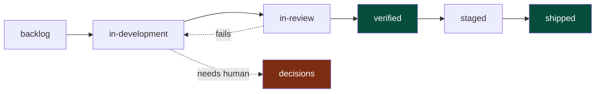
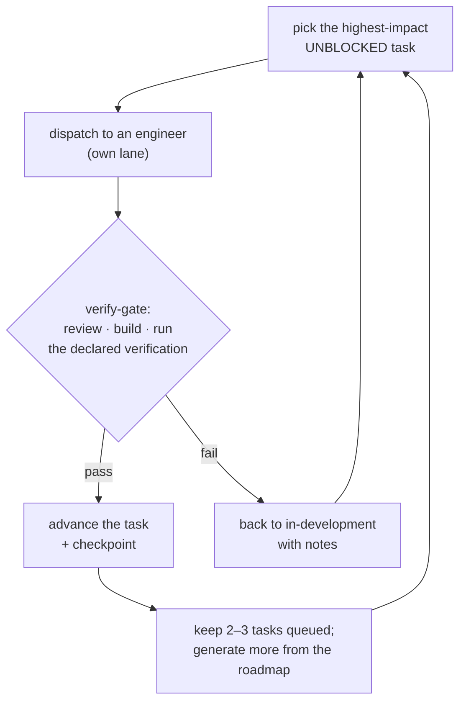

# Concepts

Workbench is a handful of small, file-based mechanisms that compose into a way of working. None of them are magic; all of them live in your repo as plain files. This page explains the model behind each.

---

## Task lifecycle

Tasks are **markdown files** under `.claude/tasks/`. A task's status *is the subdirectory it lives in* — there is no database, no status field that can disagree with reality. Moving a task between statuses is a `git mv`, so the full history is in git.

Two rules make this honest:

- **"Done" means `verified/` (or `shipped/`), with evidence.** Reaching `in-review/` only means code exists and awaits verification — the language for that is "code committed, awaiting verification," never "done." If verification fails, the task moves *back* to `in-development/`, not "almost there."
- **The in-review cap.** No more than `lifecycle.in_review_cap` (default 10) tasks may sit in `in-review/`. As the queue fills, the loop stops taking new work and drains it oldest-first. A review queue with no ceiling is exactly where "done" claims accumulate and the board stops reflecting reality.

Which stages exist depends on your [level](levels.md#lifecycle-stages-per-level): `solo` skips `in-review`; `crew` adds `staged` + `shipped`; `fleet` adds `release-candidate`. `decisions/` — the queue for things that need a human — is present at every level.

The CLI behind it: `scripts/task-new.sh` (allocates the next ID, renders the template) and `scripts/task-move.sh` (the `git mv` + status-field rewrite). The lead owns all transitions.

**Epics** group related tasks under one user-facing outcome once your `decomposition` dial is grouped (pair and up). An epic is a file in `.claude/epics/NNNN-title.md`; a task joins it via an `**Epic:**` field, and the epic's `done/total` progress rolls up live in `/workbench:mc`. Epics and tasks share one ID counter (no collisions). It's a grouping lens, not a lifecycle stage — child tasks still flow through the stages independently. `solo` stays flat (no epics). See [commands.md](commands.md#workbenchepic-title---theme-t--workbenchepic-list).

---

## The orchestration loop

The loop is a long-running teamlead cycle. The lead **coordinates**; it does not write code. Engineers implement; verifiers check.

Principles the loop never violates:

- **Verified or it didn't happen.** Nothing advances past the gate without evidence — a passing command, a screenshot, a real check.
- **Bugs auto-file; features only suggest.** A bug found mid-task becomes a task automatically. A new *feature or improvement* is surfaced as a suggestion for a human to approve — never silently built. This is universal across all levels.
- **Autonomy scales inversely with level.** At `solo` the loop just keeps going (`auto-continue`). At `fleet` every suggested direction routes through review (`suggest-review`). More coordination surface → more pausing to confirm. (`scripts/loop-policy.sh` resolves the mode from the level or a `dial_overrides`.)
- **Never stop silently.** Blocked work moves laterally to another lane; decisions for a human go to `decisions/` and the loop continues; it never spins on the same failure.

---

## Lead purpose and parking

A workbench lead session has a durable purpose under `.workbench/leads/`: one active task, one track, or an intentional backlog-scouting pass. The `SessionStart` and `UserPromptSubmit` hooks re-inject that purpose, and Claude Code can show it as the session title, so a lead is visible as "the checkout retry lead" rather than an anonymous tab.

Purpose changes the default behavior when a tangent appears. If a lead working one feature finds a different bug, feature idea, cleanup, or follow-up, it parks that work as a real backlog task via `/workbench:park` instead of widening the active branch. The parked task carries origin metadata — session, active task, purpose, and branch — and can include copied context or a diff if code already exists. The loop can later pick that task normally, with the same verification contract as any other backlog work.

---

## Continuity

Coding agents forget. Workbench makes forgetting safe with three hooks and a handoff file.

| Hook | When | What it does |
|------|------|--------------|
| `SessionStart` | every new session | Re-grounds from disk: injects an *operating brief* (project, level, task counts, what's in flight) so the session starts from reality, not a blank slate. |
| `PreCompact` | before context is compacted | Writes a durable checkpoint + a `SESSION_STATE.md` breadcrumb so nothing is lost when context is squeezed. |
| `PostToolUse` | throttled, during work | A lightweight presence heartbeat for multi-session coordination. |

The contract: **the next session should be able to resume from `SESSION_STATE.md` alone.** `/workbench:checkpoint` writes one on demand; `/workbench:boot` runs the full "verify reality, reconcile, brief" protocol when you start fresh.

---

## Coordination

When more than one Claude session is open on the same repo, they are separate processes that can clobber each other. Workbench's `scripts/coord/` tooling gives them presence and locks.

- Sessions **register** themselves and **claim** tasks; a second session sees the claim and steers clear.
- A **pre-commit guard** warns (or, at `strict` enforcement, blocks) a bulk commit when another live session has changes in the same repo — the fix is to commit with an explicit pathspec or isolate in a **worktree**.
- `/workbench:teamlead <topic>` scopes a session to a single track and locks its tasks, so multiple leads can run in parallel without collision.

The `enforcement` axis (`remind` / `warn-default` / `strict`) controls how forcefully the guards act.

---

## Workbench Mesh command center

Workbench Mesh is the richer control plane for coordinating Claude sessions across one machine or a trusted LAN. The slash command stays a thin markdown wrapper, `scripts/mesh.sh` stays a shell adapter, and the runtime behavior lives in the Rust binary launched through `bin/workbench-mesh`.

Use it in natural language when the outcome is coordination rather than file editing:

- "talk to my MacBook Claude session" routes to status/start/invite/connect guidance for another device.
- "open a lead channel" creates a structured room such as `lead:checkout`.
- "ask worker status" sends an ask/status request to the worker actor instead of inventing a new side channel.

The command center has three exposure modes:

| Mode | Command | Auth model |
|------|---------|------------|
| Local | `/workbench:mesh start --local` | Same-user access for this machine. Durable credential material lives outside git under `$WORKBENCH_HOME` (`~/.workbench` by default) with OS-protected permissions; project-local metadata may only bootstrap the current daemon and is not printed as URL authority. |
| LAN | `/workbench:mesh start --lan` | Explicit opt-in for the local network; another machine joins with a scoped invite token from `/workbench:mesh invite`. |
| Public | Deferred | Public internet exposure is out of scope in this version. |

When started for LAN, the wrapper prints every address form a user may need to copy: the host name, the `.local` mDNS name, the raw LAN IP, and the port. Ignored runtime metadata is also written to `.workbench/mesh/server.json`, so `/workbench:mesh open` can print the current command-center URL later. That file is for host/port discovery and may include an ephemeral local daemon access token, but it is not the durable same-user credential store or root key and the wrapper does not print it in invite/open URLs.

Mesh actors are hierarchical:

| Actor | Role |
|-------|------|
| Lead | Coordinates a track, room, or task ownership boundary. |
| Subagent | A delegated role running under a lead, such as engineer or verifier. |
| Worker | A joined Claude session/device that can receive asks, handoffs, and status checks. |
| Job | A task execution or handoff unit that emits lifecycle events. |

The statusline integration reads a cached mesh snapshot rather than polling the live API on every render. That keeps prompt-time overhead low while still surfacing presence, availability, and current `doing` text when a mesh is active.

---

## Discipline: brainstorm → spec → plan

Workbench leans on the [superpowers](https://github.com/obra/superpowers) skills for the *thinking* part of building. Before significant work, the expectation is brainstorm → spec → plan, then execute task-by-task with a fresh implementer per task and a review pass. `/workbench:inception` applies this to greenfield genesis: it turns an idea into a v1 spec and a seeded backlog, and refuses to proceed until you name what's explicitly **out** of v1 — scope control as a first-class step.

---

## The context backbone (architecture)

The `architecture` dial sets how formally a project maps itself, scaling with level: `none` (solo) → `context` (pair) → `containers` (crew) → `components` (fleet) — a [C4](https://c4model.com)-style progression. `init.sh` scaffolds the matching docs into `.claude/architecture/` (cumulative: context → +containers → +components), and `/workbench:level up` adds the next one non-destructively.

The model is two-sided, and the gap is the point:

- **Authored intent** — the hand-written `.claude/architecture/*.md` docs (C4 levels L1–L3): what you *mean* the system to be.
- **Extracted reality** — what the code *actually is* (the L4 "code" level + real edges), read from graphify's graphs per the `graphify` dial. Never hand-maintained.

**Drift between them is a first-class signal, not a failure** — a dependency in the code but not the docs, a component that's pure intent with no code, a module grown into a god-node. `/workbench:architecture drift` reconciles the two: it runs `scripts/arch-drift.sh` to align your declared containers/components against graphify's extracted god-nodes and prints which abstractions are named in your docs (`yes`/`no`) and which declared components have no extracted counterpart. The alignment is deliberately heuristic and **never asserts a verdict** — graphify's hubs include runtime/framework noise that doesn't belong in a C4 model — so the script aligns and you judge; real drift becomes a task. See the `architecture` skill.

---

## See also

- **[levels.md](levels.md)** — the ladder and the struggle each level solves
- **[configuration.md](configuration.md)** — every config field
- **[commands.md](commands.md)** — the full command reference
