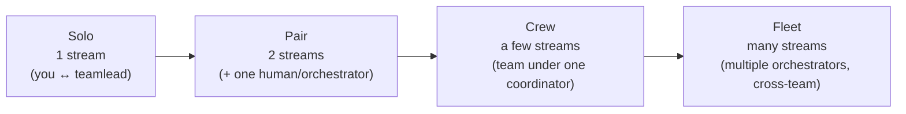
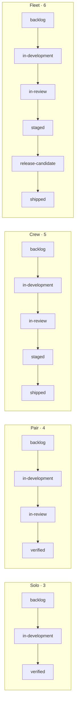
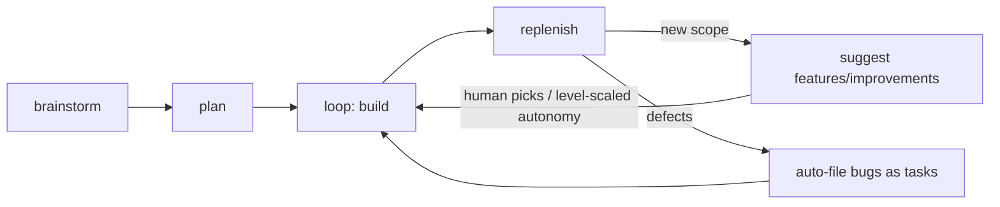
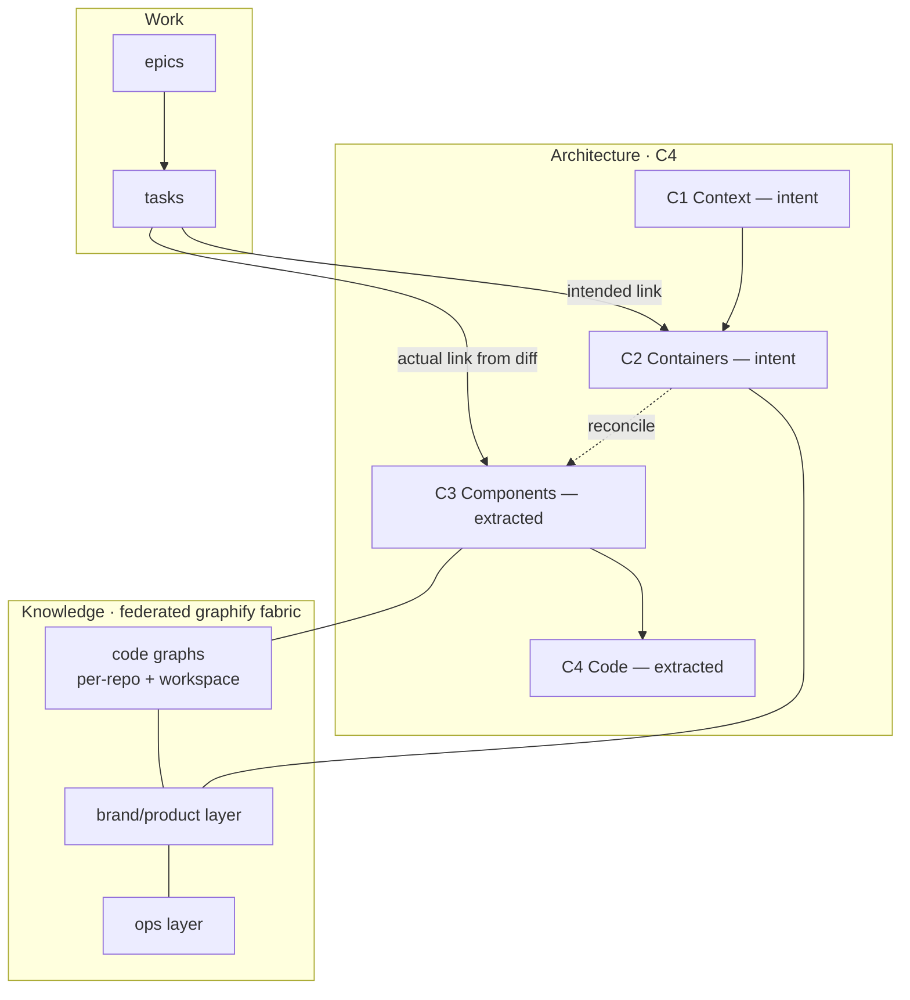

# Workbench — Foundational Design

> **Archived design snapshot.** The original brainstorm/spec as written on 2026-06-26, kept for rationale. It predates one change: the config stores only `workbench.level` and **derives** dials + lifecycle at read-time — no persisted `dials` block or `lifecycle.states`, with overrides in `dial_overrides`. Current model: [`../configuration.md`](../configuration.md) and [`../levels.md`](../levels.md).

**Date:** 2026-06-26
**Status:** Approved (brainstorm) — awaiting spec review before planning
**Supersedes the identity of:** the `initlab` plugin (`tools/initlab/`), which is rebranded to **workbench**.
**Predecessor design:** `docs/superpowers/specs/2026-06-20-initlab-plugin-design.md` (the initlab build; workbench is its next evolution).

---

## 1. Vision

Workbench is a Claude Code plugin that scaffolds and maintains an **AI-orchestrated way of working** — and, uniquely, **grows with the product**. A long-running AI "teamlead" orchestrates AI engineer lanes (and optionally humans + the Codex CLI). The thing nobody else has built: the way of working is not a fixed template, it is a **ladder** the project climbs as it scales, and a **context backbone** that keeps the teamlead grounded at every altitude.

Two design values run through everything:

- **Velocity over ceremony.** Every practice must earn its place by buying real speed or preventing real catastrophe *at that scale*. Process is refused until earned. This is the high-velocity-operator stance (question every requirement, delete, simplify, accelerate, automate), not the bureaucratic-manager stance.
- **Connect all the dots.** Architecture, knowledge, and work are one connected fabric the teamlead can traverse, not three disconnected silos.

## 2. Identity & command surface

- The plugin is renamed **`initlab` → `workbench`**; the command namespace becomes `/workbench:*`.
- **One front door: `/workbench`**, context-aware:
  - **Unconfigured project** → the **level-aware adoption wizard**: assess what already exists, give *positive feedback* on what's there, infer the project's current level, recommend a target level, and scaffold.
  - **Configured project** → status + next actions (what the loop is doing, pending suggestions, decisions awaiting the human, drift signals).
- The confusing `init` vs `setup` split is removed — there is one verb to remember, `/workbench`. Power users keep sub-commands: `/workbench:level`, `/workbench:loop`, `/workbench:task`, `/workbench:dispatch`, `/workbench:verify`, `/workbench:doctor`, etc.

## 3. Pillar 1 — The maturity ladder (the spine)

### 3.1 The four levels

Levels are keyed to **coordination surface** — how many independent streams of work the human must keep track of — *not* headcount. (Even Solo may fan out AI lanes under one teamlead; the human still sees a single coordinated stream.)

| Level | Coordination surface | Archetype |
|---|---|---|
| **Solo** | 1 stream — you work 1-on-1 with the workbench; never watch others | the iPhone note app — you and a button |
| **Pair** | 2 streams — a second person or parallel orchestrator appears | that app "getting serious" / adding Android |
| **Crew** | a handful of streams under one coordination point | a real product with paying customers + AI lanes |
| **Fleet** | many streams, multiple orchestrators, cross-team | a brand/nation-scale cloud (beebeeb is ~here) |

### 3.2 Hybrid model: levels are presets over dials

Each level is a **curated preset** that sets every dial to a sensible default. A single dial may be **overridden** without leaving the level (real products are uneven — solo builder, complex architecture). This reuses the per-axis wizard pattern from initlab.

### 3.3 The dial matrix

| Dial | Solo | Pair | Crew | Fleet |
|---|---|---|---|---|
| **Team / coordination** | solo (1 stream) | solo + AI lanes / +1 | team under one coordinator | multiple orchestrators |
| **Release** | push to main | feature-branch → main | branch → main → **tagged release + changelog** | release trains + freeze windows |
| **Work decomposition** | tasks only | tasks + light epics | epics → tasks | themes → epics → tasks |
| **Architecture (C4)** | none (one-line "what is this") | C1 context sketch | + C2 containers | + C3 components, multi-repo |
| **Surfaces** | one | two | several | many |
| **Graphify** | off | per-repo | workspace + per-repo | federated fabric (code + brand + ops) |
| **Lifecycle stages** | 3 | 4 | 5 | 6 |
| **Loop autonomy** | auto-continue (never stop) | auto-continue, light checkpoints | suggest & wait | suggest & wait + route through review |

**The loop-autonomy inversion (deliberate):** the *most* autonomous level is Solo (the loop auto-promotes its top suggestion and keeps building — you're right there to interrupt); the *most gated* is Fleet (many diverging streams demand explicit human direction). More scale → more human direction, not less. Process gating appears only when coordination actually demands it.

### 3.4 Lifecycle stages

Stages scale with level; lower levels refuse stages that are pure overhead.

- **The done→shipped gap is filled by `staged`** — the build is *live on a staging/preview environment, smoke-tested, awaiting the coordinated prod flip*. It names the **artifact's state** (an image/build is live on staging), not a vague intent — which is why it beats "queue-for-shipping." (beebeeb's current `ready-to-ship` maps directly onto `staged`.)
- **Fleet** adds a `release-candidate` gate (freeze + sign-off before the train departs).
- The counts reflect the **primary (deploy) path**. `verified` (locally verified, no deploy needed) persists as the **terminal for no-deploy work** (docs, specs, refactors) at *all* levels — it just isn't drawn on the Crew/Fleet deploy path. At Crew+, deploy-bound work flows `in-review → staged → shipped`, where `staged` implies *verified + deployed-to-staging*. The exact coexistence of the `verified` terminal and the `staged → shipped` path is detailed in Spec 2.

### 3.5 Graduation — recommend-only

The teamlead **detects graduation signals and surfaces a decision**; nothing changes without the human's yes. The human may also level up/down manually anytime.

Signals are both:
- **Explicit** — "I want to add Android," "let's bring in another engineer."
- **Observed** — a second committer appears, a `git tag` shows up, repo count grows, the in-review cap keeps overflowing, a single deploy knocks out an unrelated surface.

When a signal fires, the teamlead presents: *what level-up is suggested, exactly which dials change, and what that turns on* — as a decision, never an imposition. This matches the plugin's existing honesty-trigger pattern and the velocity/anti-bureaucracy ethos.

### 3.6 Loop engineering (universal capability)

Available at **every** level (it simply fans out more lanes at higher levels). The autonomous engine:

The carved-in-stone rule — the answer to the **ideator problem** (products drowning in unwanted features):

> **Bugs auto-file as tasks (never merely suggested). New features/improvements are *suggested* (never auto-built).**

- **Non-discretionary work** (bugs, regressions) lands in the queue with no triage ceremony, and the loop fixes it — it never stalls waiting to be told to fix what's broken.
- **Discretionary new scope** is *proposed* for human go/no-go — the AI never inflates the product with features the human didn't choose.
- What happens when the queue drains is governed by the **loop-autonomy dial** (§3.3): Solo auto-promotes the top suggestion and keeps going; Fleet presents suggestions and waits.

## 4. Pillar 2 — The context backbone

The teamlead must always have the right context at the right altitude. The backbone connects three layers:

### 4.1 C4: authored intent ↔ extracted reality

- **C1 + C2** (context + containers — *what we're building, why, and what the major pieces are for*) are **teamlead/human-authored intent** (markdown + Mermaid). They cannot be derived from code.
- **C3 + C4** (components + code structure) are **graphify-extracted from the AST** — what actually exists.
- **The backbone reconciles them; intent-vs-reality drift is a first-class signal** the teamlead surfaces ("your code grew a fifth container that isn't in the architecture — reconcile?"). This is the antidote to architecture docs that rot.

### 4.2 Work ↔ graph: intended + actual links

Each epic/task carries two links:

- **Intended touch** — authored at creation (this task *should* touch the `auth` container / `SessionStore` component). Used *before* work: blast-radius estimation, dispatch routing, cross-lane conflict detection.
- **Actual touch** — extracted from the diff *after* work (which components the changed files really belong to). Ground truth.
- **Intended-vs-actual gap = scope-drift signal** ("this task was supposed to touch auth but rewrote the storage layer").

Link richness scales with the graphify dial: at Solo (graph off) tasks are a flat list; at Pair+ they link to components; at Fleet links span domains.

### 4.3 One federated fabric

Graphify is already naturally multi-graph (per-repo graphs + a workspace cross-repo graph). The backbone **federates** these + a brand/product layer + the work items into a **single queryable fabric** where **cross-domain edges are first-class** (a task can link a code component *and* a brand rule). Domains (code / brand / ops / work) are layers that can be viewed in isolation but link freely. The fabric **emerges with level**: Solo = one repo graph → Fleet = full federated fabric.

### 4.4 How the teamlead consumes it

- **At SessionStart** — the re-ground brief includes a backbone summary (current level, C1/C2 intent headline, open drift signals, what the loop is doing).
- **On demand** — the teamlead queries the fabric (`graphify query / path / explain`) before architecture decisions, before dispatch (blast-radius/conflict), and when reconciling drift.
- **Maintenance** — the plugin installs graphify if absent and keeps it current (`graphify update` after changes), scaled by the graphify dial. No manual graph upkeep at low levels.

## 5. Master cross-reference: level → everything

| | Solo | Pair | Crew | Fleet |
|---|---|---|---|---|
| Streams | 1 | 2 | a few | many |
| Branching | push-to-main | feature → main | + tagged releases + changelog | release trains |
| Work model | tasks | + light epics | epics → tasks | themes → epics → tasks |
| Lifecycle | 3 stages | 4 | 5 (+`staged`) | 6 (+`release-candidate`) |
| C4 depth | none | C1 | C1–C2 | C1–C4 |
| Graphify | off | per-repo | workspace + repo | federated fabric |
| Loop autonomy | auto-continue | auto-continue | suggest & wait | suggest & wait + review |

## 6. Decomposition — the spec program

This design is the **foundation**. The remaining vision decomposes into focused follow-on specs, each its own brainstorm → spec → plan → implement cycle:

| # | Spec | Scope | State |
|---|---|---|---|
| **R** | `initlab → workbench` rebrand | mechanical rename: `plugin.json`, `/workbench:*` namespace, all skills/commands/agents/templates/tests, marketplace entry, the beebeeb adoption pointer in `.initlab/` → `.workbench/` | a plan, not a spec |
| **1** | **Maturity model (this doc)** | levels, dials, lifecycle, graduation, loop-engineering, single front door | **approved — ready to plan** |
| **2** | Work items: epics & lifecycle | epic file model, epic↔task relationship, level-scaled stage dirs, the `staged`/`release-candidate` transitions | needs brainstorm |
| **3** | Adoption & level detection | the `/workbench` assessment engine: signals read from git/CI/repo topology, positive-feedback framing, level inference, graduation-trigger watchers | partly sketched here (§2, §3.5) |
| **4** | Context backbone | C4 intent↔reality store, graphify federation, work↔graph linking mechanics, teamlead consumption — the *implementation* of Pillar 2 | designed here (§4); implementation needs its own plan |
| **5** | Distribution | publish to the official Claude Code plugin marketplace, zero-friction install, versioning/upgrade story | needs brainstorm |

**Recommended order:** R (rename) → 1 (this) → 2 + 3 (can run in parallel) → 4 → 5.

## 7. Migration notes

- beebeeb.io was adopted into `initlab` in-place on 2026-06-25 (`.initlab/config.json` + `manifest.json`). The rebrand (Spec R) must migrate `.initlab/` → `.workbench/` and re-point the manifest; beebeeb itself is a ~Fleet-level project and a natural first dogfood of the ladder.
- The existing initlab plugin (`tools/initlab/`, 20 green test suites) is the implementation base; workbench evolves it rather than starting over. Levels generalize the current single "profile" (minimal/full) into the four-level ladder; the existing per-axis wizard becomes the dial-override mechanism.

## 8. Open questions (resolve during follow-on specs)

- **Epic file model** (Spec 2): epics as files referencing task IDs, or tasks tagged with an epic? Where do themes live at Fleet?
- **Level inference precision** (Spec 3): exact signal → level mapping, and confidence/ambiguity handling when signals conflict (e.g., solo committer but 8 repos).
- **Fabric mechanics** (Spec 4): does federation live in a generated index file, or a graphify-native feature? How is the brand layer authored vs extracted?
- **Dial override UX** (Spec 1 plan): how a single-dial override is expressed in config and surfaced by `/workbench` without implying a full level change.
- **Downgrade semantics**: what happens to `staged`/epics artifacts if a project levels *down*.
