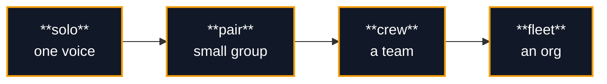
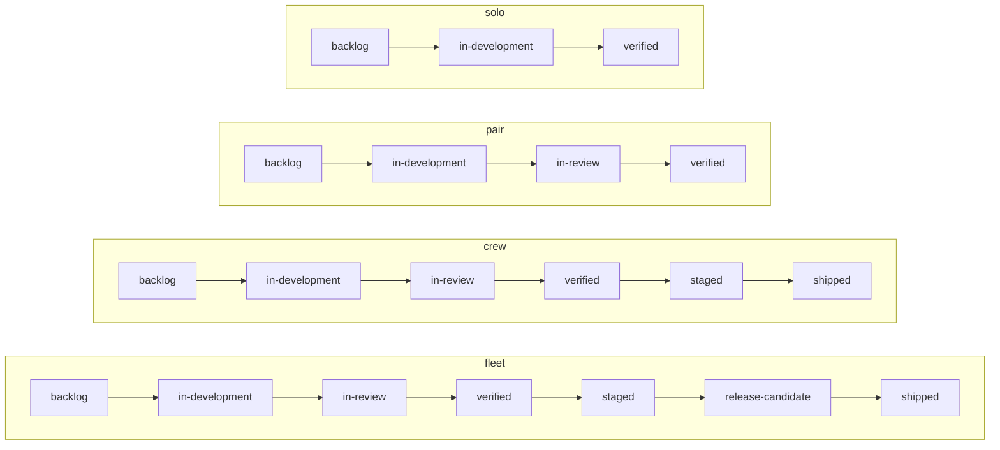

# The maturity ladder

Workbench grows with your project. Instead of one rigid process, it gives you four **levels** — `solo`, `pair`, `crew`, `fleet` — and lets you move between them as the work changes shape.

A level is not a measure of quality or seriousness. It describes your **coordination surface**: how many independent streams of work you have to keep coherent at once. A meticulous solo developer and a sloppy eight-person team can both exist; they just need very different amounts of ceremony to stay sane.



Each level is a **preset** across seven dials (below). You pick the level; the dials move together coherently. The whole point is that you never assemble an incoherent combination by hand — like "release trains" on a one-person project.

---

## The four levels, and the struggle each one solves

Every level exists to relieve a specific, concrete pain. Read these as *symptoms*: when the symptom is real, you're at (or ready for) that level. Don't graduate because a project feels like it "should" be more serious — graduate when the friction below is actually biting.

### `solo` — keep your own momentum

> **The struggle:** You're one person. Your only real enemy is your own short memory. What was I doing? What's actually finished versus what I told myself was finished? What did that session three days ago decide and why? Process is pure overhead here; you want **momentum and memory**, nothing else.

Solo strips ceremony to the floor. Work lives on `main`. There is no review queue and no staging gate. The orchestration loop runs at its **most autonomous** (`auto-continue`) — it keeps picking up the next task without stopping to ask, because there's no one else to coordinate with. What solo *does* give you is the part that actually helps a single builder: a task lifecycle so "done" means something, and continuity hooks so a new session re-grounds itself from disk instead of starting blind.

**Lifecycle:** `backlog → in-development → verified` (+ `decisions`).

**You've outgrown solo when:** a second person shows up, *or* you find yourself breaking things you finished last week and wishing you had a beat to review changes before they land on `main`.

### `pair` — stop stepping on each other

> **The struggle:** Now there are two or three of you. The new pain is collision: shipping each other's half-finished work, overwriting changes, "wait, was that ready?" You need a way to say *code exists but isn't verified yet* — explicitly, in a place everyone can see.

Pair introduces **feature branches** and an **in-review** stage: the explicit holding pen for "written, not yet verified." Review becomes a light, real step rather than a vibe. The coordination surface is still small, so the loop continues to `auto-continue` — two or three people don't need every suggestion gated, they need the work to keep flowing with a checkpoint before it merges.

**Lifecycle:** `backlog → in-development → in-review → verified` (+ `decisions`).

**You've outgrown pair when:** releases start to feel risky — "is `main` deployable *right now*?" stops having an obvious yes — *or* individual work items get too big to be single tasks and you start wishing you could group them, *or* you want somewhere to try a change before it touches production.

### `crew` — make releases boring

> **The struggle:** Three to eight people. Releases have become events instead of afterthoughts, and that's scary. Work is too big to track as a flat list of tasks — you think in features now, not tickets. And you badly want a gate between "it works on my machine" and "it's live for users."

Crew turns releases into a process you can trust. It adds **tagged releases**, **epics** (work decomposes into grouped features, not just tasks), and — critically — a **`staged`** stage that fills the gap between *verified locally* and *shipped*: build is live on staging, smoke-tested, parked and waiting for the deliberate flip to production. The loop shifts to **`suggest-wait`**: because there are now several parallel streams, the loop surfaces ranked next-directions and lets a human choose, rather than charging ahead. Architecture picks up a **container-level** map so newcomers can see the moving parts.

**Lifecycle:** `backlog → in-development → in-review → verified → staged → shipped` (+ `decisions`).

**You've outgrown crew when:** there are too many parallel streams to keep in your head, *or* you're juggling multiple repositories that have to stay coherent, *or* ad-hoc tags aren't enough and you need scheduled release *trains* with a formal release-candidate gate.

### `fleet` — govern many streams at once

> **The struggle:** Eight or more contributors, organization scale. The pain is no longer collision or risky releases — it's *governance*. Many independent streams, federated repositories, and no single person who can eyeball it all. You need structure that holds without anyone holding it.

Fleet is the heaviest preset, and deliberately so. It adds **release trains** (scheduled, not ad-hoc), **themes over epics** (another layer of decomposition), a **`release-candidate`** stage, **federated** knowledge graphs across repos, and **component-level** architecture detail. The loop runs at its **most gated** (`suggest-review`): every suggested direction routes through the review gate before anything proceeds, because at this scale an unreviewed autonomous decision is a liability, not a convenience.

**Lifecycle:** `backlog → in-development → in-review → verified → staged → release-candidate → shipped` (+ `decisions`).

**Note the inversion:** autonomy runs *opposite* to level. Solo is the most autonomous and fleet the most gated. More coordination surface means more reasons to pause and confirm — so the loop gets *more* careful, not less, as you climb.

---

## The seven dials

The level name is shorthand; the dials are the real configuration. Workbench derives them from your level at read-time — there's no copy of them stored to drift out of sync.

| Dial | What it controls | `solo` | `pair` | `crew` | `fleet` |
|------|------------------|--------|--------|--------|---------|
| `team` | Expected team topology | solo | pair | crew | fleet |
| `release` | How changes reach production | push-to-main | feature-branch | tagged-releases | release-trains |
| `decomposition` | How work is broken down | tasks | light-epics | epics | themes-epics |
| `architecture` | Context-backbone formality | none | context | containers | components |
| `surfaces` | User-facing entry points | one | two | several | many |
| `graphify` | Knowledge-graph scope | off | per-repo | workspace | federated |
| `loop_autonomy` | How autonomous the loop runs | auto-continue | auto-continue | suggest-wait | suggest-review |

> `graphify` also appears as a `way_of_working` axis. The **dial above is authoritative for scope**; the axis is a coarse on/off toggle the setup wizard keeps aligned. See [configuration.md](configuration.md#way_of_working).

### Overriding a single dial

You can keep a level's preset but override exactly one dial — e.g. you're a `crew` but don't want full-workspace graphify yet. Add it to the optional flat `dial_overrides` object in `.workbench/config.json`:

```json
{
  "workbench": { "level": "crew" },
  "dial_overrides": { "graphify": "per-repo" }
}
```

The level stays `crew`; it now means "crew preset, except `graphify=per-repo`." Resolution always checks `dial_overrides` first, then falls back to the level preset. If an override matters for how agents behave, note it in your project's `CLAUDE.md`.

---

## Lifecycle stages per level

Higher levels add task lifecycle directories that match their coordination needs. `decisions/` (the human-input queue) is present at every level.



| Level | Stages added |
|-------|--------------|
| `solo` | backlog, in-development, verified, decisions |
| `pair` | + in-review |
| `crew` | + staged, shipped |
| `fleet` | + release-candidate |

Moving **up** adds the missing directories non-destructively — existing tasks are untouched. Moving **down** does **not** remove directories; pruning them is a deliberate manual step so you never lose work by changing a setting.

---

## Adopting into an existing repo — detected for you

When you run `/workbench:workbench` on a repo that already has history, it doesn't make you guess your level. `scripts/detect-level.sh` reads your git + repo signals — distinct committers, release tags, non-trunk branches, and repositories under `repos/` — and recommends a starting level, taking the *strongest* signal (a two-person repo split across five sub-repos is `crew`, not `pair`). The setup wizard states the recommendation and the reasoning, and you confirm or override. It is recommend-only; you always decide.

## Graduating between levels

```text
/workbench:level            show the current level and all dials
/workbench:level up         move one step up the ladder
/workbench:level down       move one step down
/workbench:level <name>     jump directly to solo | pair | crew | fleet
```

Graduation is **recommend-only**. `/workbench:level up` prints exactly which dials change and which lifecycle directories it will add, then asks for confirmation before applying. It never forces a change.

For a data-driven nudge, `scripts/graduate.sh` reads git signals — commit cadence, contributor count, branching model — and *suggests* a level. It is a suggestion engine, never an actuator: **the human always decides.** That is the same principle the loop follows everywhere — bugs file themselves as tasks automatically, but new directions are only ever *suggested*.

---

## See also

- **[configuration.md](configuration.md)** — the full `.workbench/config.json` model
- **[concepts.md](concepts.md)** — the task lifecycle, continuity, coordination, and the loop in depth
- **[getting-started.md](getting-started.md)** — install and your first scaffold
