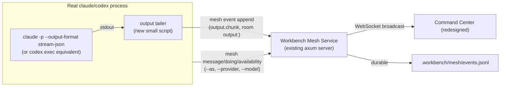

# Mesh Command Center Redesign — Design

> **Note (2026-07-04):** this spec's 2-tab design ("Overview"/"Admin") was superseded before ship by a later, uncommitted handoff that shipped the current 5-tab layout (Bench/Board/Host/Ops/Docs — see `crates/workbench-mesh/assets/command-center/app.js`). This document is kept for history; it does not describe the shipped product.

## Intent

The current Mesh command center (`crates/workbench-mesh/assets/`) is a plain dark operator console: 10 flat sections (Overview send-form, Leads, Workers table, Rooms, Jobs, Tasks, Decisions, Invites, Devices, Audit) plus a raw event-feed. It works, but it reads as an admin panel, not an overview of a live AI team.

The redesign's goal: a human should be able to glance at the dashboard and immediately answer three questions — *who's connected, what are they doing, and what are they saying to each other* — without hunting through sections. A secondary goal, prompted by this same conversation: mesh currently has no way to tell two real, separately-running Claude/Codex processes apart by device, provider, or model, which this redesign's data needs surface as a real gap to close.

This spec also visually restyles the dashboard using the Beebeeb Design System (a real, existing `claude.ai/design` project the user maintains for the separate Beebeeb product) — warm paper/ink OKLCH tokens, a single amber accent, Inter + JetBrains Mono, and the same sidebar/topbar/content/detail-panel app-shell shape as Beebeeb's own web app kit.

## Scope

**In scope:**
- A new "Overview" tab: agent roster (sidebar) + team chat (main) + per-agent live-output feed (a second tab within the main pane, opened per selected agent).
- Restyling the existing 10-section console as an "Admin" tab — same functionality, Beebeeb visual tokens applied, no functional changes.
- Extending the mesh protocol's presence payload with `provider` and `model` fields (mesh already has `platform`/`capabilities` from a prior change this session).
- A new `output.chunk` event type + per-agent `output:<actor>` room convention, populated by a small tailer wrapping each real session's structured/streaming CLI output.
- Light/dark theming that follows `prefers-color-scheme`, with a manual override toggle.

**Out of scope (explicitly):**
- No frontend framework migration. The dashboard stays vanilla HTML/CSS/JS talking to the existing Rust/axum server over the existing HTTP/WebSocket API — only the presentation layer changes.
- No change to the underlying event log format, auth model, or WebSocket protocol beyond the one new event type.
- The Admin tab's *functionality* does not change — it is a reskin, not a redesign, of the 10 existing sections.
- Public internet exposure, LAN protocol changes — untouched.
- The actual 6-real-instance live demo and its screenshots are a separate, later step (this spec covers the dashboard + data model it needs, not the demo orchestration itself).

## Architecture

The tailer is a new, small standalone script (not a change to `workbench-mesh` itself): it launches or wraps a real CLI process, reads its structured stream, extracts tool-call and assistant-message boundaries (not raw token deltas — too noisy for a human-facing feed), and forwards each as an `output.chunk` event via the existing `workbench-mesh message`-style CLI append path, targeting the per-agent `output:<actor>` room instead of a shared coordination room.

## Data model additions

`presence.heartbeat` / `actor.status` payloads (posted by `mesh availability` / `mesh doing`) gain two new fields, mirroring how `platform`/`capabilities` already work:

- `provider` — free-form string (e.g. `"claude"`, `"codex"`). No auto-detection possible from inside a session (a Claude session can't reliably introspect "which CLI am I"), so this is always explicit: `--provider <name>` flag, falling back to a `WORKBENCH_MESH_PROVIDER` env var, defaulting to `"unknown"` if neither is set.
- `model` — free-form string (e.g. `"sonnet"`, `"fable"`, `"gpt-5"`). Same explicit-only pattern: `--model <name>` flag / `WORKBENCH_MESH_MODEL` env var / `"unknown"` default.

New event type `output.chunk`, added to `ALLOWED_EVENT_TYPES` in `protocol.rs`:
- `room`: `output:<actor>` (a dedicated per-agent room, never mixed with coordination-chat rooms)
- `payload`: `{ "kind": "tool_call" | "message", "summary": "<one-line human-readable text>" }` — a *summary*, not the raw tool input/output (keeps the feed skimmable and avoids leaking large diffs/secrets into the event log by default)

## Overview tab

**Layout** (matches Beebeeb's Sidebar + Content app-shell shape):

- **Sidebar** (left): one card per connected actor — name, `device/OS · provider · model` (mono, small), current purpose/doing text, and a one-line last-output snippet. Cards use the Beebeeb `bb-chip`-style left accent border in amber when an actor has fresh activity.
- **Main pane** (right, the dominant area): two tabs —
  - **Team chat** (default, full pane): the existing coordination room(s) — `message`/`ask`/`handoff`/`room.created` events — rendered as chat bubbles, sender name in mono/amber above each bubble (reusing the `--as` identity work from earlier this session).
  - **`<agent>`'s output** (opens on clicking a sidebar card): that agent's `output:<actor>` room, rendered as a lighter-weight scrolling log (mono, tool-call lines prefixed/colored distinctly from assistant-message lines).

**Empty states:** no connected actors → sidebar shows a single calm empty-state card (Beebeeb's existing empty-state pattern: icon + one line + no error styling). No messages yet in team chat → same treatment, not a blank white/dark rectangle.

## Admin tab

Unchanged functionality: Leads, Workers table, Rooms, Jobs, Tasks, Decisions, Invites, Devices, Audit — all 9 remaining sections plus the send/ask/reassign/revoke/retry actions. Restyled only: Beebeeb typography classes (`t-h2`/`t-h3`/`t-body`/`t-mono`/`t-eyebrow`), paper/ink tokens, amber reserved for primary actions and encryption/security-relevant chips (matching Beebeeb's own rule that amber is never decorative).

## Theming

`prefers-color-scheme` sets the initial theme; a small toggle in the topbar lets the user override for the session (stored in `localStorage`, same pattern the current dashboard already uses for the bearer token). Both palettes come directly from the Beebeeb Design System's `colors_and_type.css` tokens (`:root` for light, `.dark` for dark) — no new color decisions, just applying the existing system.

## Testing

- Existing `test/mesh-command-center.test.sh` continues to assert the Admin tab's state/actions are present (updated for the new tab wrapper, not removed).
- New assertions: `output.chunk` is accepted by `ALLOWED_EVENT_TYPES` and rejected outside an `output:*` room shape (mirrors how other event types are room-scoped today); `provider`/`model` fields round-trip through `doing`/`availability` the same way `platform`/`capabilities` do (same test pattern as `doing_reports_platform_and_capabilities_in_payload`).
- Visual verification: Playwright screenshots of both tabs, light and dark, with at least 2 synthetic actors in the sidebar and non-empty team chat + output feed — before this ships as part of a release.

## Open items carried forward (not blocking this spec)

- The actual 6-real-instance demo (mix of real `claude`/`codex` processes) that will populate this dashboard for real screenshots is separate follow-up work, described in the parent conversation but not itself speced here.
- The output tailer script's exact CLI wrapping details (how it launches vs. attaches to an already-running process, exit/restart handling) will be worked out during implementation planning, not in this design doc — it's a small utility, not an architectural decision.
