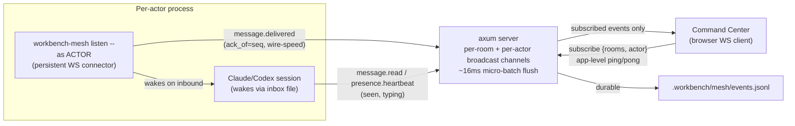

# Mesh Real-Time Protocol & Chat UX — Design

## Intent

The command center v2 (shipped in `2026-07-03-mesh-command-center-redesign-design.md`) made the mesh dashboard look like a live team overview, but the plumbing underneath is still poll-heavy: the dashboard loads the *entire* event log on every open, auto-scroll is the only chat behavior, and the only "is someone alive" signal is a manually-triggered `presence.heartbeat{activity}` that lags behind what's actually happening by up to a second. There is no delivery/read receipt of any kind — `message.delivered` and `message.read` are allowlisted event types that nothing has ever produced or consumed.

The user's framing: this needs to feel like a real, fast group chat — "I need to have the feeling I'm just talking with a group of people." Two concrete complaints drove this: (1) replying in the terminal visibly happens faster than the dashboard reflects it, and (2) there's no insight into what's happening between "I sent a message" and "an agent replied" — no ack, no typing, no sense of whether the message even landed.

This spec also explicitly designs for scaling out to ~8 engineers plugging into the same mesh, which rules out the current "broadcast every event to every connected socket" model — at that scale it's both wasted bandwidth and a privacy leak (everyone's DMs cross everyone else's wire even if the UI hides them).

## Scope

**In scope:**
- Protocol: repurpose the two dead `message.delivered`/`message.read` event types into a real receipt chain (`ack_of`-linked), keep `presence.heartbeat{activity}` for non-message-specific typing/idle state.
- Server: replace the single global broadcast channel with per-room + per-actor channels and a subscribe control frame, so each WS client only receives events relevant to it.
- Server: micro-batch outbound WS frames (~16ms flush window) to protect render performance when multiple agents stream concurrently.
- New `workbench-mesh listen --as ACTOR` connector: a persistent Rust WS client that ACKs message delivery at wire speed, independent of whether the actor's Claude Code session is awake, and wakes the session via the existing inbox-file mechanism.
- Chat pagination: cursor-based `GET /api/events?room=&before=&limit=50`, initial load of last 50 per thread, lazy-load older on scroll-up, DOM mount cap (~150 rows) with `content-visibility: auto` for off-screen rows.
- Optimistic local echo on send, three-tier receipt UI (sent → server-received → delivered → seen), room aggregate "seen by N/M".
- RTT/ping insight per connected actor (app-level ping/pong for the browser client, native WS ping/pong for the Rust connector).
- Reconnect: fast first retry (250ms) with capped, jittered exponential backoff; resubscribe rooms on reconnect.
- Ack/seen events feed the same presence-freshness calculation as heartbeats.
- Client-side animated ("typewriter") reveal of already-received boundary chunks, so message arrival doesn't feel like a bucket dump.

**Out of scope (explicitly, deferred to a follow-on spec):**
- Intent-based forwarding / "smart host" routing (detecting that an @-less message is meant for a different agent and forwarding it). Depends on this protocol existing first; gets its own spec.
- True token-level streaming of model output (`output.delta` at generation pace). Would require re-opening the tailer's deliberate boundary-only design (no raw token deltas or tool output, to avoid leaking sensitive content mid-generation across an 8-engineer mesh). Noted as a future extension point — the client's animated-reveal renderer is structured so real deltas could later replace the animation timer without a rewrite.
- Binary wire format (protobuf/msgpack). At chat-message volumes even with 8 concurrent agents, JSON parse cost is noise; not worth the complexity yet.
- Any change to auth model, LAN/public exposure, or the event log's on-disk format.

## Architecture

## Protocol & event schema

- **`EventEnvelope`** (`protocol.rs`) gains a top-level `ack_of: Option<u64>` field alongside the existing `v, id, seq, type, room, from, to, ts, payload`. Promoting it out of `payload` lets the store index "all receipts for message X" and lets `validate_event_room` enforce that an ack can only reference a message the acking actor was actually addressed by (same room, or `to == acking actor`).
- **`message.delivered`** — repurposed (was dead/unused). Payload: `{ack_of: <seq>}`. Emitted by the addressee's `listen` connector the instant the frame lands on its socket — before the Claude session is necessarily awake.
- **`message.read`** — repurposed (was dead/unused). Payload: `{ack_of: <seq>}`. Emitted by the actual Claude/Codex session once it wakes and starts composing a response (replaces today's implicit "reading" activity heartbeat for message-specific tracking).
- **`presence.heartbeat{activity: "typing" | "idle"}`** — unchanged shape, kept for the non-message-specific "someone's actively composing" chip (today's typing-line UI).
- **ACK scope**: only addressees ack. A DM is acked only by its recipient; a room post is acked by every actor currently subscribed to that room (each with their own `message.delivered`/`message.read`), giving per-person room receipts rather than a single blob.
- **Server-received tier**: not a new event type — it's the existing WS `{"type":"ack","seq":...}` reply the server already sends on successful append, now also driving the first receipt tier in the UI (see below).

## Server-side subscription filtering

Replace the single `broadcast::Sender<EventEnvelope>` (`server.rs:131/229`, currently fed to every connected socket unfiltered) with:
- One `broadcast::Sender<EventEnvelope>` per room, created lazily on first subscriber.
- One unicast channel per actor for anything with `to == actor`, regardless of room.
- On WS connect, the client sends a `{"type":"subscribe","rooms":[...]}` control frame (dashboard: rooms currently rendered; `listen` connector: the actor's own inbox + every room the actor is a member of, from `room.member_added` history). The server always includes the actor's own unicast channel regardless of what's requested.
- Room membership changes mid-session (joining a new room) send an updated subscribe frame; the server diffs and adjusts the socket's subscriptions live.
- **Micro-batching**: instead of pushing each broadcast event to a socket as its own WS frame, the server accumulates matching events for ~16ms and flushes them as one frame containing an array. Imperceptible to a human, but collapses N re-renders into one when multiple agents stream `output.chunk` concurrently.

## Connector process (`workbench-mesh listen`)

New subcommand: `workbench-mesh listen --as ACTOR [--target <path>]`. A persistent Rust WS client (not the bash+python poll loop it replaces) that:
1. Connects and sends the actor's subscribe frame (own inbox + member rooms).
2. On any inbound frame addressed to the actor (message.sent, task.handoff, mention, etc.), immediately emits `message.delivered{ack_of: seq}` over the same connection — wire-speed, independent of whether anything is currently waiting to be woken.
3. Writes each inbound message to a per-actor named pipe (`.workbench/mesh/inbox-<actor>.fifo`) it creates on startup. The harness-facing wake step (today's `mesh-inbox-wait.sh` background task, polled every 0.5s) is replaced by a blocking read on that pipe — a `read` on a FIFO blocks with zero CPU until `listen` writes to it, so wake latency drops from up to 500ms to wire-speed with no polling at all. The blocking reader still exits after one message and gets re-armed by the harness, exactly like today's pattern — only *how it waits* changes, not the harness contract.
4. Uses native WS ping/pong (available to a Rust client, unlike browser JS) to measure and report connector↔server RTT.
5. Stays running for the lifetime of the actor's dev session, independent of the harness-facing reader's re-arm cycle — one long-lived `listen` process keeps acking every message and feeding the pipe; `serve --as` continues to be how the mesh server itself starts, this is a separate always-on client process per actor.

This subsumes `mesh-inbox-wait.sh`'s polling role (the blocking-read-then-exit contract is unchanged, only its wait mechanism moves from polling the event log to reading the pipe `listen` feeds); the poll-based script is kept as a fallback path only if a `listen` binary isn't available (e.g. before a rebuild).

## Chat pagination & rendering

- New endpoint: `GET /api/events?room=<room>&before=<seq>&limit=50`, newest-first (client reverses for display), scoped to a room or to `to == actor` for DMs.
- Thread open: fetch last 50, render, scroll to bottom (existing behavior, preserved). Scroll within ~150px of the top fetches the next 50 older, prepends, and corrects `scrollTop` so the view doesn't jump.
- DOM mount cap of ~150 rows (3 pages) per open thread — scrolling back down past that unmounts the oldest page (data isn't discarded, just re-fetched if scrolled back up).
- `content-visibility: auto` + `contain-intrinsic-size` on message rows instead of hand-rolled virtual scrolling — the browser skips layout/paint for off-screen rows for free, without the scroll-anchoring bugs a hand-rolled virtual list would risk in a no-build vanilla-JS codebase.

## Optimistic send & receipts

- On send, the message renders immediately with a client-generated temp id and `state: "sending"` — no waiting on the network round trip.
- Reconciles to the real `seq` and flips to `state: "sent"` on the existing WS `{"type":"ack","seq":...}` reply (this is the "server-received" tier — confirms the message left the client and was durably appended).
- `WB.RECEIPTS[seq] = {serverReceivedAt, deliveredBy: Set<actor>, seenBy: Set<actor>}`, built by consuming `message.delivered`/`message.read` events keyed by `ack_of`.
- DM tick progression: sent → server-received → delivered → seen (single/double/colored check). Room posts: compact "seen by 6/8" text, expandable to an avatar list with per-person timestamp.
- A message stuck at "server-received" (no `message.delivered` within ~30s) surfaces a subtle "no response yet" hint — signals the addressee's `listen` connector is down, not merely that a human is slow.

## Streaming feel (animated reveal)

No wire protocol change for this: when a finished `output.chunk`/`message.sent` arrives, the client reveals its text progressively (character-by-character at a natural reading pace) instead of inserting it into the DOM all at once. Tool-call chips get a lighter "assemble" animation (icon + summary fading in). This is purely a client rendering technique — it does not make anything actually stream at generation pace, but removes the "bucket dump" feeling of chunks appearing instantly. True generation-pace streaming is the deferred `output.delta` extension noted above; the reveal renderer is structured so that a future real delta stream could drive it directly instead of a timer.

## RTT / connection insight

- Browser dashboard: app-level `{"type":"ping","t":<client_ts>}` sent every ~5s over the existing WS connection; server echoes `{"type":"pong","t":<echoed_ts>}` verbatim, client computes RTT as `now - t`. Native WS ping/pong isn't observable from browser JS (handled invisibly at the protocol layer), so this has to be an application-level round trip.
- `listen` connector: uses native WS ping/pong directly (available to a Rust client below the browser sandbox), same ~5s cadence.
- Both numbers are per-actor and surfaced as a small value next to that actor's presence dot in the roster — e.g. "guus-lead · 340ms" — so a slow-feeling mesh is diagnosable (bad connection vs. a genuinely slow agent) rather than guessed at.

## Presence freshness & reconnect

- `message.delivered`/`message.read` events feed the same freshness calculation as `presence.heartbeat` (currently a 12s decay window, `app.js`) — any receipt is itself fresh proof-of-life, not just periodic heartbeats. No new event volume, just wider consumption of what's already emitted.
- Reconnect: first retry at 250ms (covers the common case — a blip), then capped exponential backoff with jitter up to ~5s, avoiding thundering-herd reconnects against the server at 8-actor scale. On reconnect, replay from `last_seq` (existing mechanism) and re-send the subscribe frame.

## Error handling

- Pagination fetch failure: inline retry affordance at the top of the message list; doesn't disturb the currently-rendered view.
- `ack_of` referencing an unknown seq or an actor that wasn't the addressee: rejected by `validate_event_room`, same enforcement pattern as today's room-scoping checks.
- `listen` connector process dies: no `message.delivered` ever arrives, surfaced via the 30s "no response yet" hint above; the inbox-file wake mechanism it would have triggered simply doesn't fire, so the underlying Claude session degrades to needing a manual nudge — same failure mode as today, not worse.

## Testing

- `protocol.rs`: `ack_of` validation — must reference a real seq, actor must be the addressee or a subscribed room member.
- `server.rs`: subscription filtering (actor subscribed only to room X never receives room Y traffic; DMs always land regardless of subscription); pagination endpoint correctness against a seeded 120-event fixture (ordering, `before`/`limit` windowing).
- `listen` connector: e2e test measuring ack latency from event-post timestamp to `message.delivered` receipt, asserting sub-100ms on localhost.
- UI action harness: optimistic-echo reconciliation (temp id → real seq), receipt tick state transitions, scroll-position preservation across a prepend, animated-reveal renderer doesn't break on rapid-fire chunks.
